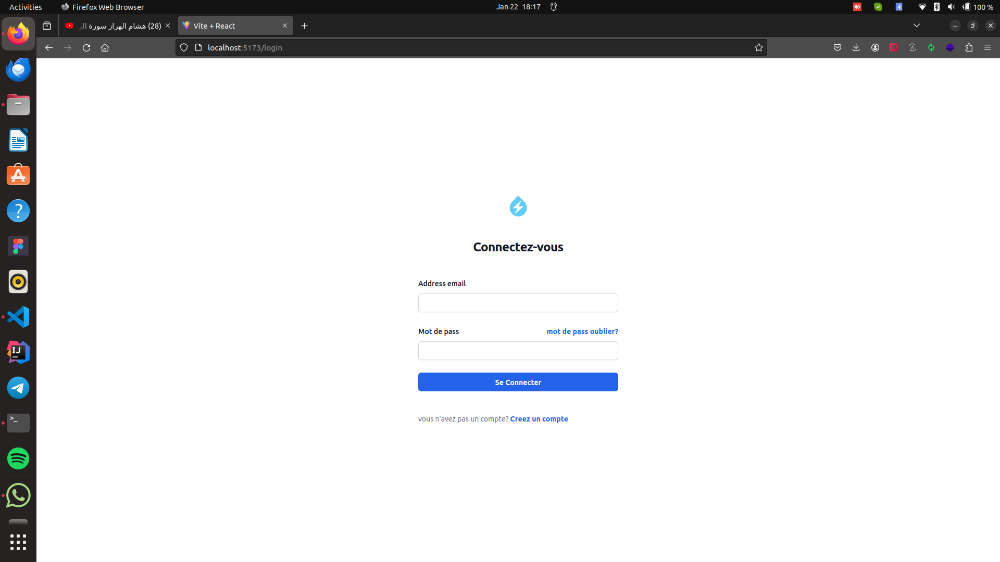
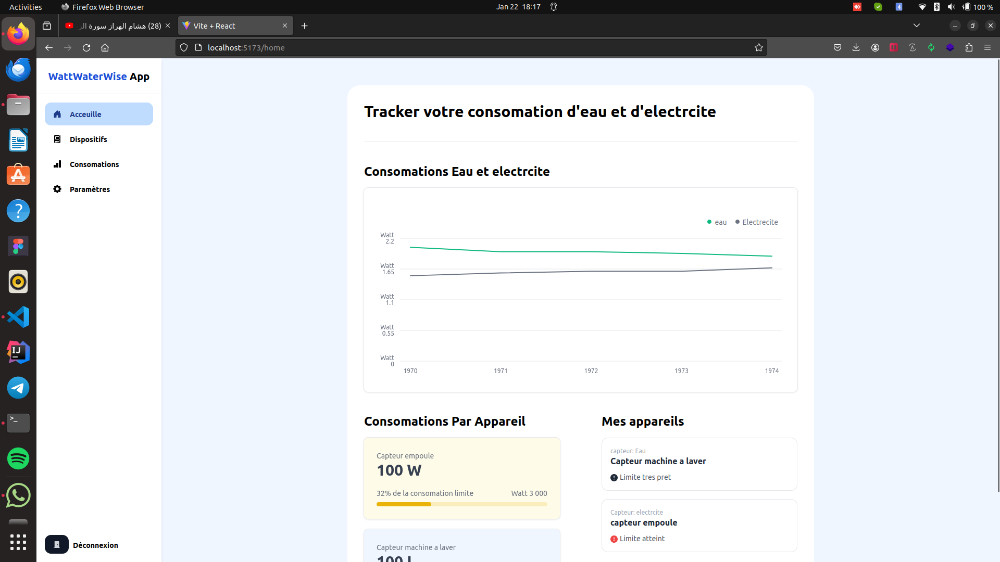
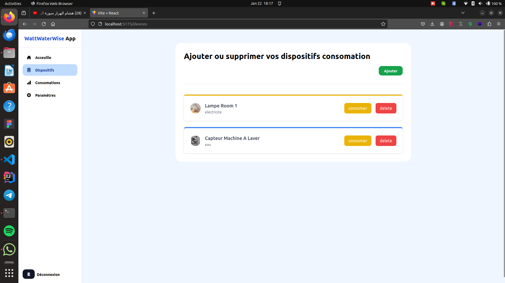
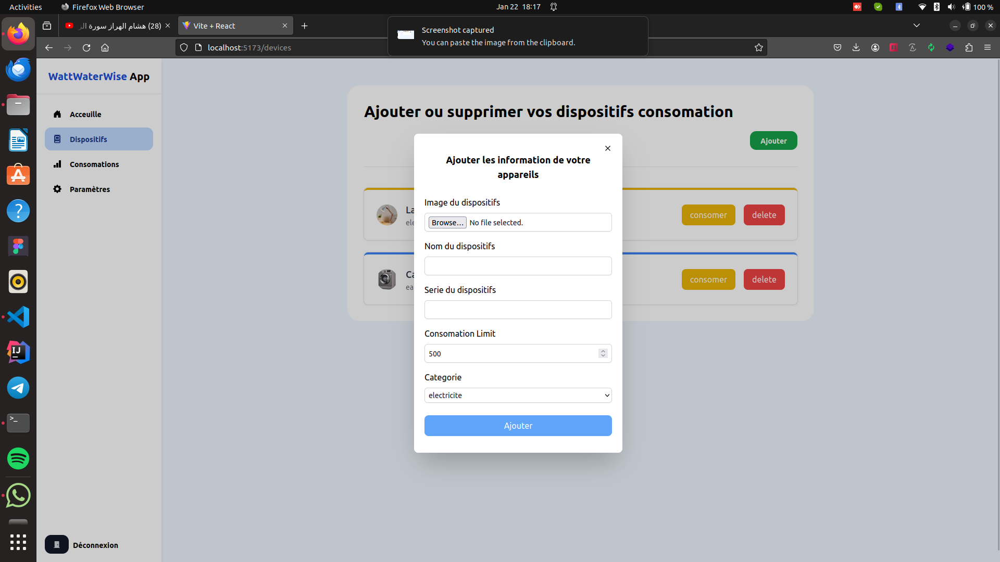

# FULLSTACK IOT APP
## ! IMPORTANT
### BACKEND SETUP
- first install the required packages
``` bash
    npm install
```
- create **.env** file and add to it this basic setup
```
    DB_URL="yout mongodb connection database url"
    SERVER_PORT="running port"
    SECRET_KEY="secret ket for jwt"
```
- finally run the backend server using the following command:
``` bash
    npm run start
```
### FRONTEND SETUP
- navigate to the frontend folder using the following command:
```  bash
    cd frontend/
```
- then install the required packages for the project to run using the following command:
``` bash
    npm install
```
- finally run the frontend using the followinf comman:
``` bash
    npm run dev
```
## IN APP SCREENSHOTS
- login page


- home page


- devices page


- add devices
